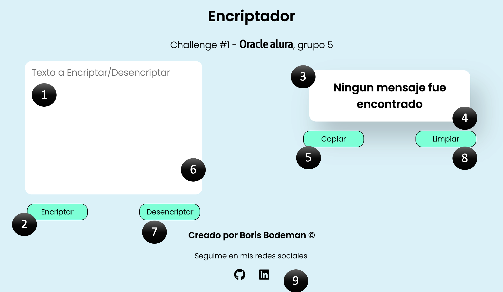

# Readme - Encriptador - Guia de uso.

## 

---

1. Text area para introducir Texto a encriptar/desencriptar.
1. Boton para encriptar.
1. Area de texto tratado.
1. Aparecera el texto encriptado o desencriptado segun corresponda.
1. Boton para copiar el texto tratado.
1. Pegar el texto copiado para tratar nuevamente.
1. Boton para desencriptar texto encriptado.
1. Limpiar el area para que no aparezca ningun texto.
1. Links a mis redes sociales.

---

Realizado por Boris Bodeman.
# encriptador.github.io
